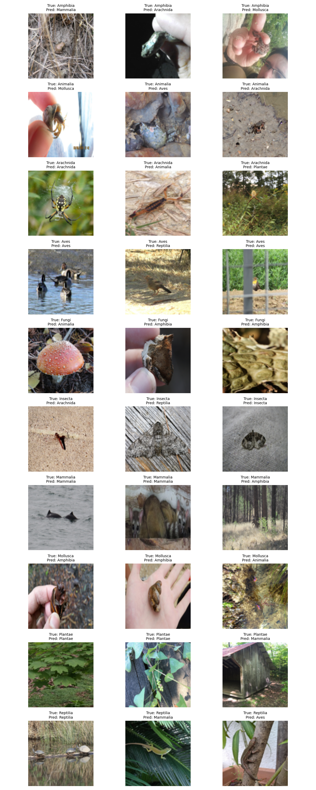
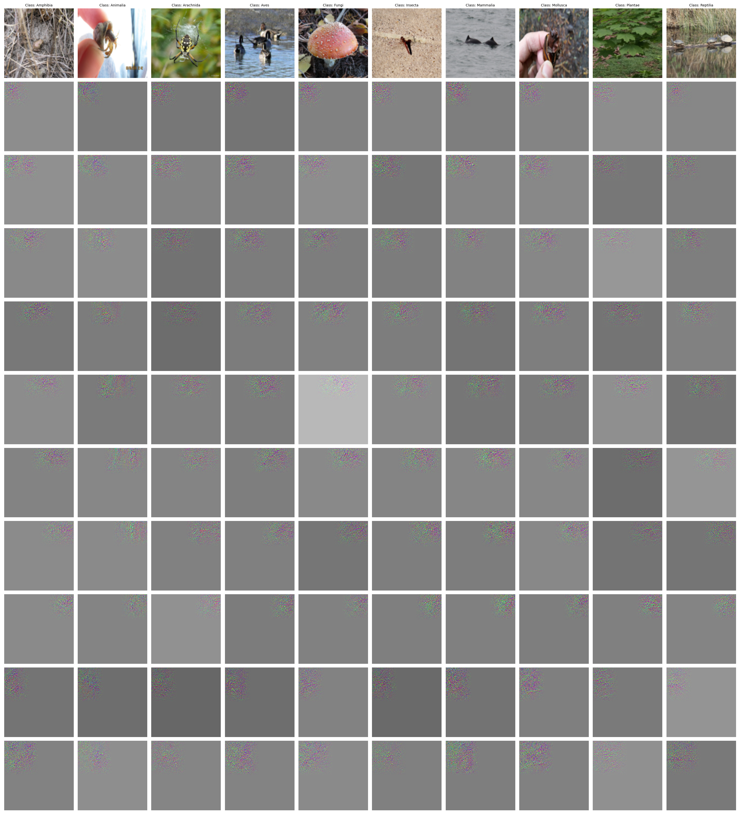

# DA6401 Assignment 2 DA24M016


## Project Links

- **WandB Report**: [DA6401 Assignment 2 Report](https://wandb.ai/da24m016-indian-institute-of-technology-madras/da6401_assignment2/reports/DA6401-Assignment-2--VmlldzoxMjM1NTMzNg?accessToken=vcpmcbhiyqf981k5x7nuhxz25esx2d3lpv1jh6qyf179xv4hzz0rzvyw2c4lh897)
- **GitHub Repository**: [saimanikumar-da24m016/da6401_assignment2](https://github.com/saimanikumar-da24m016/da6401_assignment2)


**Repository Structure**
```
./partA
  ├── model.py
  ├── train_partA.py
  ├── partA-da6401-assignment2.ipynb
  ├── best_file_checkpoints/
  ├── test_images_grid.png
  └── guided_backprop_grid.png

./partB
  ├── train_partB.py
  ├── partB-da6401-assignment2.ipynb
  └── partB_prog_unfreeze_grid.png

./partC
  └── partC-da6401-assignment-2.ipynb

README.md
```

---

## Part A: Training from Scratch (5 Conv Blocks + Dense)

**Model:** `LitCNN` in `partA/model.py` with 5×(Conv3×3 + Activation + MaxPool2×2), one hidden dense, and a 10‑way output.

**Hyperparameters sweeps:** Bayesian search over
- `filter_organization`: same / double / half filters
- `activation`: relu / gelu / silu / mish
- augmentation: on/off
- batch_norm: on/off
- dropout in FC: 0.2 / 0.3
- dense neurons: 256 / 512
- learning rate: 1e‑3 / 1e‑4

**Best config:**
```json
{
  "filter_organization": "double",
  "activation": "silu",
  "data_augmentation": true,
  "batch_norm": true,
  "dropout": 0.3,
  "dense_neurons": 256,
  "learning_rate": 1e-4
}
```

**Results:**
- Train accuracy: ~48.4%, loss ~1.43
- Test accuracy: ~42.2%, loss ~1.65

**Visualizations:**

Sample grid of 3 test images/class:  


Guided backprop for 10 neurons in conv5:  


---

## Part B: Fine‑tuning EfficientNetV2‑S

**Approach:** Load `efficientnet_v2_s` pretrained on ImageNet, replace classifier head, freeze all but last *k* blocks.

**Sweep over:**
- `freeze_before` blocks: [5, 7, 9]
- `dropout`: [0.2, 0.3]
- `learning_rate`: [1e‑3, 1e‑4]

**Best single‑stage config:**
```json
{
  "freeze_before": 7,
  "dropout": 0.3,
  "learning_rate": 1e-4
}
```
Test accuracy: ~85.9%

**Progressive unfreezing:** four stages of 5 epochs each—head only, +1 block, +2 blocks, then full network.
- Final test accuracy: **85.85** (loaded best checkpoint)


---

## Part C: YOLOv3 Object Detection Demo 

In `partC/partC-da6401-assignment-2.ipynb`, we apply a pretrained YOLOv3 model to a sample video clip ("Raptor Chase" from *Jurassic World Dominion*), detect bounding boxes and class labels per frame, and render annotated video.

---

## How to Run

1. **Part A**  
   ```bash
   cd partA
   python train_partA.py --config ../common_config.json
   ```

2. **Part B (sweep)**  
   ```bash
   cd partB
   python train_partB.py --mode sweep --config ../common_config.json
   ```

3. **Part B (prog unfreeze)**  
   ```bash
   python train_partB.py --mode prog --config ../best_params.json
   ```

4. **Part C**  
   Launch the Jupyter notebook in `partC/` and follow instructions.

---


All hyperparameter sweeps and visualizations are automatically logged to Weights & Biases  **da6401_assignment2**.


